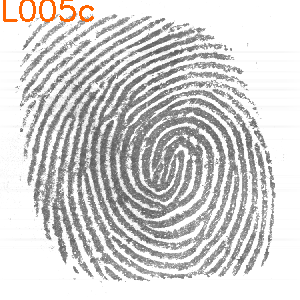
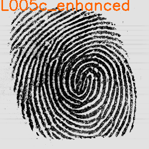
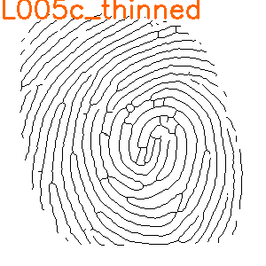

# Fingerprint Identification

## 1. Implement the fingerprint enhancement

## 2. Compute the Orientation Map
## 3. Load the Fingeprint type annotation
## 4. Region of interest detection
## 5. Singular point detection (Poincaré index)
## 6. Fingerprint Type Classification
## 7. Thining

## 8. Minutiae Extraction
## 9. Pattern Matching
